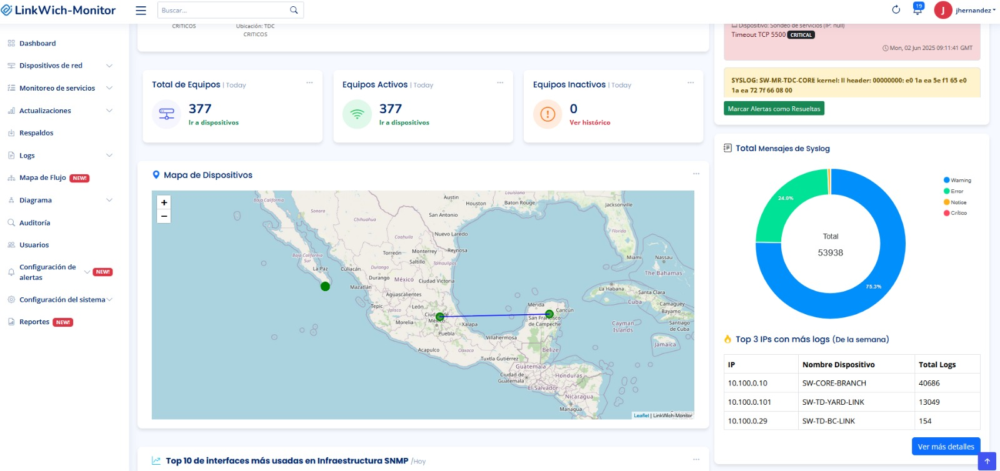
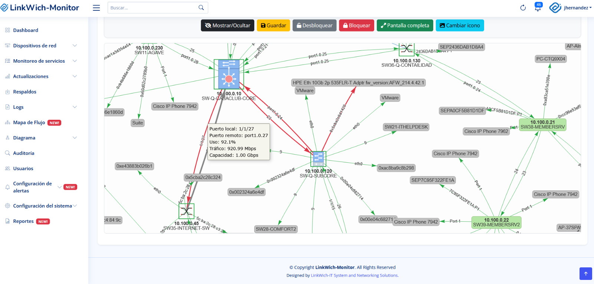
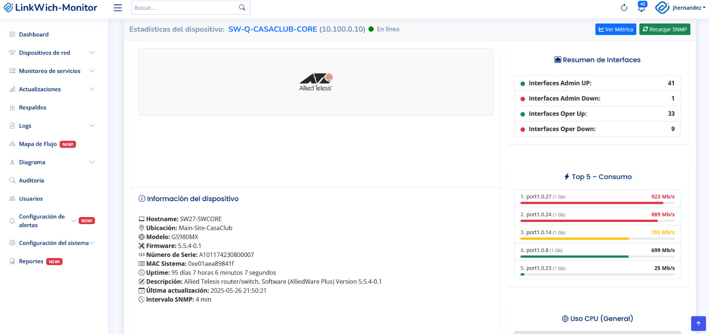
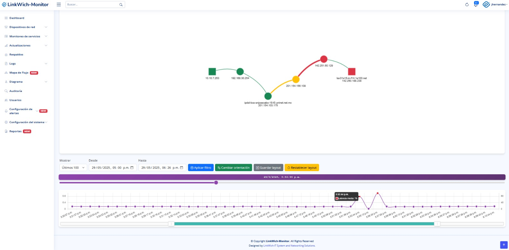
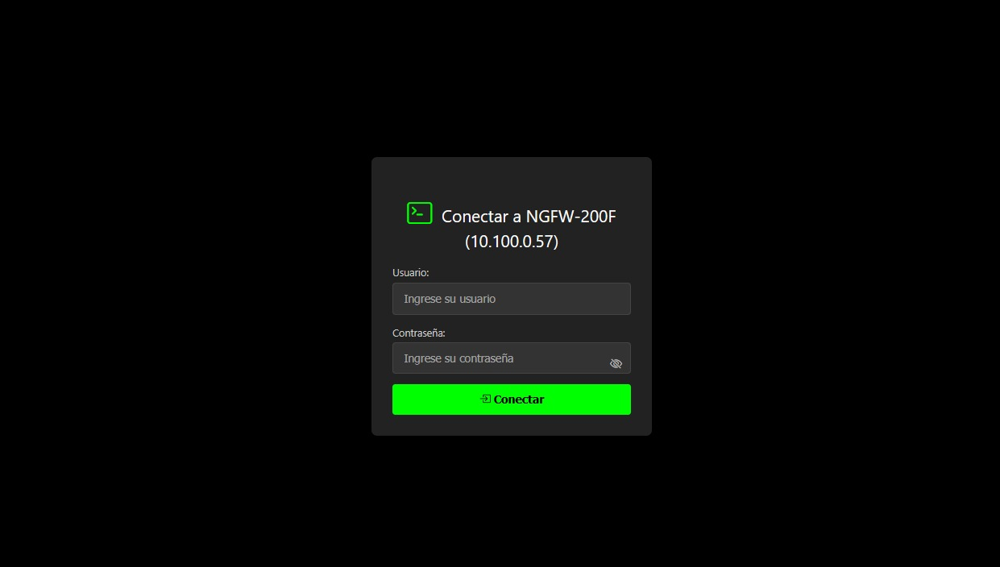

  

<h1 align="center">LinkWich-Monitor</h1>

  <strong>Tu plataforma integral de monitoreo de redes e infraestructura</strong>

  
  
  
  

---

## 📖 Introducción

**LinkWich-Monitor** es la solución todo-en-uno diseñada para administradores de red que buscan visibilidad, control y automatización en una misma plataforma. Con un **dashboard interactivo**, **mapas de topología automáticos**, **alertas avanzadas**, **respaldos programados**, **reportes profesionales**, **syslog** y acceso **SSH web**, LinkWich-Monitor te brinda una experiencia ágil y profesional para gestionar cualquier infraestructura de TI.

---

## 📋 Tabla de Contenidos

1. [Características Principales](#-características-principales)  
2. [Capturas de Pantalla](#-capturas-de-pantalla)  
3. [Requisitos de Hardware y Software](#-requisitos-de-hardware-y-software)  
4. [Instalación Rápida](#-instalación-rápida)  
5. [Primeros Pasos](#-primeros-pasos)  
6. [Documentación Completa](#-documentación-completa)  
7. [Colaborar y Contribuir](#-colaborar-y-contribuir)  
8. [Licencia](#-licencia)  

---

## ✨ Características Principales

- 🖥️ **Dashboard Interactivo**  
  Diseño modular con tarjetas movibles; personaliza tu vista y accede rápidamente a métricas clave.  

- 🌐 **Topología Automática (LLDP / CDP)**  
  Mapa dinámico de red con filtros por grupo y dispositivo; guarda y recupera layouts personalizados; información detallada al hacer clic en cada nodo.  

- 🔔 **Alertas Avanzadas**  
  • Monitoreo SNMP para caídas de dispositivos.  
  • Reglas de syslog por nivel de severidad, palabra clave y exclusiones de IP.  
  • Notificaciones por correo electrónico (configurables por grupo/dispositivo).  

- 💾 **Respaldos Automatizados**  
  Programación diaria, semanal o mensual de respaldos de configuración vía SSH en switches y routers compatibles.  

- 📈 **Reportes Profesionales**  
  • Disponibilidad histórica por dispositivo.  
  • Uso de ancho de banda por interfaz.  
  • Historial y resumen de syslog con interpretación básica de IA.  
  • Exportación a PDF o impresión directa.  

- 📡 **Terminal SSH Web Integrada**  
  Consola estilo PuTTY dentro del navegador; múltiples sesiones simultáneas, registro de comandos y auditoría de accesos.  

- 🔄 **NetPath Inteligente**  
  Traceroute avanzado con trazado de múltiples rutas, latencia, pérdida de paquetes y gráficos interactivos.  

- 🖱️ **Interacción Visual y Diagnóstico**  
  • **Ver Interfaces:** con un solo clic, muestra en pantalla las estadísticas SNMP de cada interfaz (tráfico, errores, estado).  
  • **Buscar MAC:** botón dedicado para filtrar y localizar direcciones MAC en la tabla de switching, sin escribir comandos.  
  • **Prueba TDR (Time Domain Reflectometry):** ejecuta un test de cableado desde la interfaz web y muestra resultados de reflectometría automáticamente.  
  • **Descubrimiento LLDP:** botón “Mapear Vecinos” que ejecuta la consulta LLDP y despliega automáticamente los vecinos conectados.  
  • **Comandos de Visualización Predefinidos:** menú desplegable con opciones como `show interfaces`, `show mac-address-table`, `show lldp neighbors`, etc., que se ejecutan al presionar y presentan la salida en pantalla.  
  • **Upgrade de Equipo:** acción gráfica para iniciar el proceso de actualización de firmware/configuración vía SSH, todo controlado desde el panel sin ingresar a CLI.  

---

## 📸 Capturas de Pantalla

  
  

  
  
  

---

## 📋 Requisitos de Hardware y Software

A continuación se muestran los requisitos de hardware y software para instalar y ejecutar LinkWich-Monitor de manera óptima.

| Componente                      | Requisito Mínimo                          | Recomendado / Notas                                              |
|---------------------------------|-------------------------------------------|------------------------------------------------------------------|
| **Sistema Operativo (Servidor)**| Windows Server 2019 (x64)                 | Windows Server 2022 (x64)                                        |
|                                 | Windows 10 / 11 (x64)                     | Windows 10 Pro / Windows 11 Pro                                  |
| **Procesador (CPU)**            | 4 cores (x64, 2.0 GHz)                    | 8 cores (x64, 3.0 GHz o superior)                                 |
| **Memoria RAM**                 | 8 GB                                      | 16 GB o más                                                      |
| **Almacenamiento (HDD/SSD)**    | 50 GB libres                              | SSD NVMe de 100 GB o más                                         |
| **Base de Datos**               | MariaDB 10.4+                             | MariaDB 10.6+                                                    |
| **Dependencias de Python**      | Python 3.9+                               | Python 3.10+; entorno virtual (venv)                             |                                   |
|                                 | requests                                  | Última versión estable                                          |
|                                 | eventlet (para Flask-SocketIO)            | Última versión estable                                          |
| **Tarjeta de Video (GPU)**      | No es obligatoria                         | NVIDIA con soporte CUDA (p. ej. RTX 20/30/40 series) para IA     |
|                                 |                                           | *(Requerida solo si se desea acelerar procesamiento de modelos)* |
|**Servidor con salida a Internet**| Obligatorio para el envio de correos     | Obligatorio para el envio de correos
| **Navegador Web (Cliente)**     | Chrome, Firefox, Edge o Safari (actualizados) |                                                              |

> **Nota sobre IA y GPU:**  
> Para aprovechar las funcionalidades de análisis de logs basadas en modelos de IA, se recomienda contar con una **tarjeta de video NVIDIA** con soporte CUDA. Sin embargo, LinkWich-Monitor funcionará correctamente sin GPU dedicada; empleará CPU, aunque con menor rendimiento en inferencia de modelos.

> **Espacio adicional en disco:**  
> - Logs históricos y respaldos automáticos pueden requerir almacenamiento extra (dependiendo del volumen de datos).  
> - Se sugiere reservar al menos **100 GB** en el servidor si se prevé un uso intensivo de reportes, dashboards y archivos de respaldos.  

---

### Requisitos según cantidad de Dispositivos

| Cantidad de Dispositivos | CPU (mínimo)                   | RAM (mínimo)                        | Tarjeta de Video                                    | Tarjeta de Red                                     | Notas                                 |
|--------------------------|--------------------------------|-------------------------------------|------------------------------------------------------|----------------------------------------------------|---------------------------------------|
| Hasta 50                 | Intel Core i5 (o equivalente)  | 8 GB DDR4 (o equivalente DDR3)      | No obligatoria (recomendada NVIDIA con CUDA para IA) | 1 Gbps                                             | Hasta 500 sensores                    |
| 51 – 150                 | Intel Core i7 (o equivalente)  | 16 GB                               | No obligatoria (recomendada NVIDIA con CUDA para IA) | 1 Gbps (varias NIC si hay múltiples VLAN/redes)   |                                       |
| Más de 150               | Intel Core i9 (o equivalente)  | 32 GB                               | No obligatoria (recomendada NVIDIA con CUDA para IA) | 1 Gbps (varias NIC si hay múltiples VLAN/redes)   | En Windows Server: soporte para NIC-TEAM |

---

# 🚀 **Instalación Rápida – Puertos y Reglas de Red necesarias**

Para que **LinkWich-Monitor** funcione sin bloqueos, asegúrate de **permitir los puertos** que usa la aplicación y sus servicios integrados.

---

## 📦 **Resumen de puertos**

> Valores **por defecto**. Si cambias algún puerto en tu despliegue, ajusta el firewall en consecuencia.

| Puerto | Proto | Dirección | Módulo / Servicio | ¿Para qué sirve? | ¿Obligatorio? | Notas / Recomendaciones |
|---:|:---:|:---:|---|---|:---:|---|
| **5000** | TCP | **Entrada** desde la LAN | **UI Web (Hypercorn HTTPS)** | Acceso a la consola web de LinkWich-Monitor | ✅ | URL: `https://IP:5000/`. Requiere certificados TLS válidos en `ssl/`. |
| **5002** | TCP | **Entrada** desde la LAN | **Terminal Web hacia equipos** | Consola SSH a dispositivos vía navegador | ✅ (si usas terminal) | Asegura el acceso a `https://IP:5002/terminal/...`. Restringe por IPs de administración. |
| **514** | UDP | **Entrada** desde dispositivos | **Syslog Receiver** | Recepción de logs desde switches/routers/UPS | ✅ (si usas Syslog) | En los equipos, apunta el **servidor syslog** a `IP:514/UDP`. Considera NAT/firewall intermedio. |
| **69** | UDP | **Entrada** desde dispositivos | **TFTP embebido** | Transferencia de firmware/respaldos | ☑️ Opcional | TFTP usa puertos **efímeros** además del 69/UDP. Abre/permite **relacionados** o usa NAT stateful. |
| **2121** | TCP | **Entrada** desde dispositivos | **FTP embebido** (si se habilita) | Alternativa a TFTP para archivos | ☑️ Opcional | Servicio desactivado por defecto. Si se usa **FTP pasivo**, define un rango y permítelo en el firewall. |
| **3000** | TCP | Entrada **local** (loopback) | **WhatsApp Bot (NodeJS)** | Vinculación QR y mensajería | ☑️ Opcional | Por defecto local. Si expones a la LAN, **restringe**. Puede variarse con `WA_BOT_PORT`. |
| **443 / 465 / 587** | TCP | **Salida** a Internet / SMTP | **Correo saliente** | Envío de notificaciones por email | ✅ (si envías correo) | Abre el puerto según tu proveedor (TLS/SSL). |
| **22 / 23** | TCP | **Salida** a dispositivos | **SSH / Telnet a equipos** | Respaldos, comandos y terminal | ✅ | Prefiere **SSH (22)**. Permite retorno de sesiones (stateful). |
| **161** | UDP | **Salida** a dispositivos | **SNMP Polling** | Métricas y descubrimiento SNMP | ✅ (si usas SNMP) | Permite respuestas UDP de vuelta (stateful). Traps (162/UDP) no requeridos salvo uso explícito. |
| **ICMP** | — | **Salida** a destinos | **PING / NetPath** | Latencia y disponibilidad | ✅ | Autoriza **Echo Request** saliente y **Reply** entrante (stateful). |
| **53 / 123** | UDP | **Salida** a Internet | **DNS / NTP** | Resolución de nombres y hora | ✅ | Recomendada sincronía NTP para tokens/SSL. |
| **9200** | TCP | **Salida** a Elastic (si aplica) | **Elasticsearch** | Carga de índices de Syslog/Métricas | ☑️ Opcional | Solo si tu despliegue usa Elastic externo. |

---

## 🔐 **Reglas mínimas de firewall (recomendación)**

- **Desde la LAN de administración hacia el servidor**: permitir **TCP 5000** (UI) y **TCP 5002** (Terminal Web).  
- **Desde dispositivos hacia el servidor**: permitir **UDP 514** (Syslog) y, si usas archivos, **UDP 69** (TFTP) y/o **TCP 2121** (FTP).  
- **Desde el servidor hacia los dispositivos**: permitir **TCP 22** (SSH), **UDP 161** (SNMP), **ICMP** (PING).  
- **Salida del servidor a Internet**: **SMTP 443/465/587**, **DNS 53**, **NTP 123**, y **Elastic 9200** si aplica.  
- **WhatsApp Bot** (opcional): mantiene una sesión con WhatsApp por **HTTPS** (salida). El puerto **3000/TCP** puede quedar **solo local**; expón a la LAN únicamente si lo necesitas y **limita por IP**.

> 💡 **Buenas prácticas**
> - Restringe el acceso a **5000/5002** solo a redes/hosts de administración.  
> - Usa **SSH** en lugar de Telnet.  
> - En TFTP/FTP, limita origen por subred y considera una **zona DMZ** si es posible.  
> - Mantén **NTP activo** para evitar problemas con **TLS** y **2FA**.

---

## ⚙️ **Parámetros útiles (cuando necesites ajustar)**

- **UI HTTPS (5000/TCP)**: puerto del servicio web.  
- **Terminal Web (5002/TCP)**: acceso a `…/terminal/<IP>?name=<EQUIPO>`.  
- **WhatsApp Bot**: variable de entorno **`WA_BOT_PORT`** (por defecto 3000).  
- **Elastic**: activa/desactiva con **`ELASTIC_ENABLED=1|0`** si tu despliegue usa Elasticsearch externo.

> 📝 Si cambias puertos en tu instalación, **documenta el cambio** y **actualiza el firewall** de inmediato.

---

## ✅ **Checklist rápido**

- [ ] **5000/TCP** abierto (UI Web).  
- [ ] **5002/TCP** abierto (Terminal Web), restringido por IP.  
- [ ] **514/UDP** abierto desde dispositivos (Syslog).  
- [ ] **22/TCP**, **161/UDP**, **ICMP** permitidos **del servidor a los equipos** (stateful).  
- [ ] **SMTP/DNS/NTP** de salida permitidos.  
- [ ] **TFTP 69/UDP** y/o **FTP 2121/TCP** abiertos **solo** si usas archivos.  
- [ ] (Opcional) **3000/TCP** local para WhatsApp Bot (o expuesto con restricción).  

---
